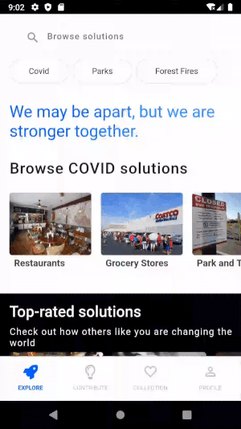
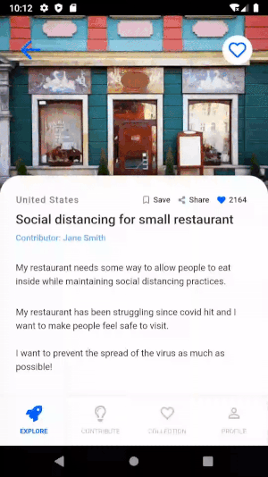
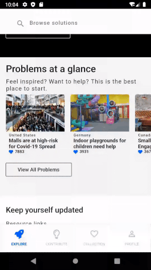
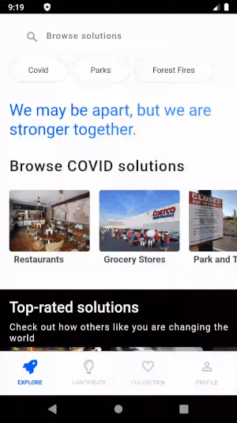
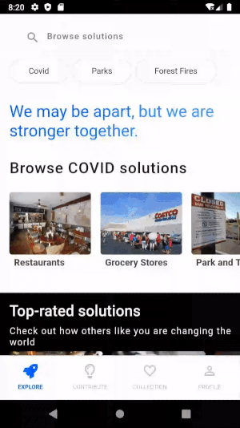
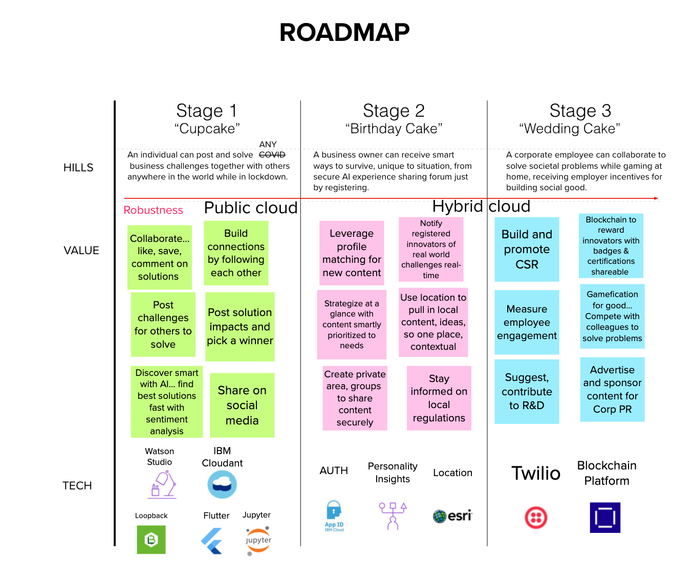

<!-- Header -->

<!-- omit in toc -->
<h1 align="center" style="font-size:42px;border-bottom:none;">
  BuildUP
</h1>
<h2 align="center" style="border-bottom: 1px solid #eaecef;">
  Empower individuals to Innovate and BuildUP a resilient society together
</h2>

> This package was implemented using [Flutter](https://flutter.dev/) and [LoopBack 4](https://loopback.io/doc/en/lb4/)
> and applies design standards and color themes based on the [Carbon Design System](https://www.carbondesignsystem.com/).
> The database used for all data storage is [IBM Cloudant](https://www.ibm.com/cloud/cloudant).
> Additionally, [Watson Studio](https://www.ibm.com/ca-en/cloud/watson-studio) and [Jupyter Notebook](https://jupyter.org/) on the [IBM Cloud](https://cloud.ibm.com) are utilised for review insights.
> The solution's reward system also makes use of [IBM Blockchain Platform](https://www.ibm.com/cloud/blockchain-platform/).

<!-- Quick Links -->

<a href="https://youtu.be/Tf7JL9LKUZc">View Demo</a>
·
<a href="https://github.com/narayanacoder/BuildUP/issues">Report Bug</a>

----

## Authors

- [Carla Aravena](https://www.linkedin.com/in/carla-aravena/)
- [Narayana Madineni](https://www.linkedin.com/in/narayana-m-696b6230/)
- [Jessica Nahulan](https://www.linkedin.com/in/jessicanahulan/)
- [Harini Srinivasan](https://www.linkedin.com/in/harini-srinivasan-47b63b/)
- [Jessika Welch](https://www.linkedin.com/in/jessika-welch/)

<!-- omit in toc -->
## Table of Contents
- [Authors](#authors)
- [Overview](#overview)
  - [Problem Background](#problem-background)
- [The Solution](#the-solution)
  - [How can technology help?](#how-can-technology-help)
- [How it works](#how-it-works)
- [Architecture](#architecture)
- [Implemented App interaction preview](#implemented-app-interaction-preview)
- [Technology](#technology)
- [Getting started](#getting-started)
  - [Prerequisites](#prerequisites)
  - [Steps](#steps)
    - [1. Set up an instance of Watson Studio](#1-set-up-an-instance-of-watson-studio)
    - [2: Provision a CouchDB instance using Cloudant](#2-provision-a-couchdb-instance-using-cloudant)
    - [3. Run the server](#3-run-the-server)
    - [4. Run the mobile application](#4-run-the-mobile-application)
- [Roadmap](#roadmap)
  - [Current(Cup Cake):](#currentcup-cake)
  - [Mid-term(Birthday Cake):](#mid-termbirthday-cake)
  - [Long-term(Wedding Cake):](#long-termwedding-cake)
- [Resources and documents](#resources-and-documents)
  - [IBM Cloud Services](#ibm-cloud-services)
  - [Flutter](#flutter)
- [Contributing](#contributing)
- [License](#license)

----

## Overview

### Problem Background

[4 out of 5 workers are affected by COVID-19 worldwide - United Nations](https://www.npr.org/sections/coronavirus-live-updates/2020/04/07/828778490/4-of-5-workers-are-affected-by-covid-19-worldwide-u-n-agency-says)

[1.6 billion people are at risk of losing livelihoods - International Labor Organization](https://news.un.org/en/story/2020/04/1062792)

[100,000 US small businesses have closed forever - Washington Post](https://www.washingtonpost.com/business/2020/05/12/small-business-used-define-americas-economy-pandemic-could-end-that-forever/)

Covid-19 has created new challenges and has impacted many lives and small businesses.

With over 50% of the world’s workforce – 1.6 billion - at risk of losing their livelihoods (International Labor Organization, Apr 29), there is a need to act NOW, not only to right the ship, but to reinforce it, so this suffering will not endure and will be less likely to occur again in a future disaster or pandemic. Businesses and communities need help finding ways to adapt to the new normal before they fall victim to it.

----

## The Solution

BuildUP is an app that provides a way for anyone in the world to help solve local or large-scale challenges like the COVID-19 pandemic while staying safe. Users can act in several ways – posting a challenge, solving a challenge, providing feedback on solutions, tracking and sharing – simply through a smart phone. Regardless of the way a user acts, each user benefits from a sense of purpose greater than themselves, a benefit that is in especially great demand during this time of social isolation.
 

 Using AI, individuals’ posts of challenges and solutions are matched and ranked for relevance, associated with others’ posts, turned into insights and auto-suggested to users in need of solutions. AI increases the expediency and impact of individuals’ crowdsourced contributions. Ideas and insights on how to adapt for success in their unique situation of local guidelines can be pushed to a user based on their profile and preferences.

Because the app is a venue for collaboration across communities, countries, and continents, it provides a wealth of inspiration right at the user's fingertips. The product's core content is built through the kindness, creativity, resourcefulness and collaboration of individuals connecting around the world. 

 
The power of this app is three-fold; it builds up the individual, builds up the economy and builds up society all at once… a win, win, win. As the system becomes smarter leveraging AI and the growing number of user contributions, it builds protection against future societal threats to our economic livelihood and can be used as a framework for the new challenges that arise, whatever they may be. 

By using IBM techniques to tame bias in data and methodologies used in our AI solutions, BuildUp provides more relevant solutions leading to faster successes in greater number; it increases public trust and confidence in artificial intelligence.

 
In addition, the BuildUP roadmap describes opportunities for private, secure areas of collaboration and innovation that can be built to benefit larger organisations in research and development, customer relationships, employee recruitment, engagement, wellness and retention, and corporate social responsibility. Sometimes a wake-up call of disaster can provide an exclusive opportunity to adapt on an astronomical scale and become stronger and better than before.

&nbsp;&nbsp;

&nbsp;&nbsp;

----

### How can technology help?

Mobile, web, and cloud services enable rapid deployment of applications that can empower cooperation in the community. [IBM Cloudant](https://www.ibm.com/cloud/cloudant/) is a fully managed scalable distributed database service for hybrid multicloud applications on [IBM Cloud](https://cloud.ibm.com) that allows you to store data for web and mobile applications.

Creating a cloudant database to store application data can help you address the issues such as responsiveness that users may face when using an application with millions of users. Cloudant database is optimized for handling heavy workloads for large, fast-growing web and mobile apps.

 [IBM Watson Studio](https://www.ibm.com/cloud/watson-studio/) is used to simplify and scale data science across any cloud. It can be used to build and train Artificial Intellgence models. With its open, flexible multicloud architecture, Watson Studio provides capabilities that empower applications to simplify enterprise data science and AI.
 
Creating a Watson Studio instance to perform summarization, topic modelling/theme identification, word cloud generation, top reviews identification and sentiment analysis on review comments can help applications with thousands of comments to quickly get useful insights.

[IBM Blockchain Platform](https://www.ibm.com/cloud/blockchain-platform/) is used to allow build networks that leverage blockchain technology faster using Hyperledger Fabric. Web applications can leverage the platform to use the benefits of a blockchain.

Creating a rewards program network on a local Fabric network, installing and instantiating a smart contract through IBM Blockchain extension for VS Code can help applications reward points for community who help solve business problems through innovative solutions. Small businesses may reward community members who solve their problems. Community members are encouraged to solve more problems and work towards redeeming rewards by partner small businesses.

----

## How it works

A problem poster (who may be a normal individual, a small business owner or a large business) that is facing challenges due to COVID-19 (or any other global or community issue) posts the problem title, description and images/video of the problem using the mobile application or web application. He/she typically fills out a brief form that describes the problem. This information is then stored in a cloudant database in the IBM Cloud.

A problem solver/innovator, who believes in community cooperation and solving problems together, opens the mobile application and can browse/search the problems posted based on the individual's preferences. He/she picks a problem, draws sketches or takes a video and uploads the title, description and images/videos about the solution. Multiple innovators can submit solutions using the user interface as well as comment on other solutions. They can share solutions through social networks to encourage collaboration and attract feedback. The application also displays identified themes, top strong comments and word cloud for the review comments. 

The problem poster(small local business owner/any individual) can choose the best solution, implement the solution and post the outcomes. The business owner rewards the innovator who posted the best solution. Using Watson AI, other similar business owners will be notified about the problem, best solution and impact based on the similarities in the profile so that they can implement the same solution for their business.

----

## Architecture

BuildUP combines sentiment analysis (Watson Studio), Cloudant data storage to hold the profiles, problems, solutions and review comments to get users the information they need.

----

## Implemented App interaction preview

1. Users can browse posted problems and solutions.

&nbsp;&nbsp;&nbsp;&nbsp;

&nbsp;&nbsp;

2. The individual who posted the problem can choose the best solution, implement it and optionally post the impact outcome.
   
&nbsp;&nbsp;&nbsp;&nbsp;

   
3. The Innovator can pick a problem and post solutions to solve the problem, as well as receive feedback from everyone, summarized review comments to improve the solution by implementing the comments.
   

&nbsp;&nbsp;&nbsp;&nbsp;

&nbsp;&nbsp;

4. The Innovator or problem poster can save solutions and problems for later viewing, and easily browse through a collection of their own submissions.
   
&nbsp;&nbsp;&nbsp;&nbsp;

----

## Technology

- [IBM Cloud](https://www.ibm.com/cloud)
- [Watson Studio](https://dataplatform.cloud.ibm.com/docs/content/wsj/getting-started/welcome-main.html)
- [IBM Cloudant](https://cloud.ibm.com/docs/Cloudant?topic=cloudant-overview)
- [Node.js](https://nodejs.org)
- [Flutter](https://flutter.dev/)
- [LoopBack 4](https://loopback.io/doc/en/lb4/)
- [IBM Blockchain for Developers](https://developer.ibm.com/technologies/blockchain/)
  
----

## Getting started

### Prerequisites

- Register for an [IBM Cloud](https://www.ibm.com/account/reg/us-en/signup?formid=urx-42793&eventid=cfc-2020?cm_mmc=OSocial_Blog-_-Audience+Developer_Developer+Conversation-_-WW_WW-_-cfc-2020-ghub-starterkit-cooperation_ov75914&cm_mmca1=000039JL&cm_mmca2=10008917) account.
- Install and configure [IBM Cloud CLI](https://cloud.ibm.com/docs/cli?topic=cloud-cli-getting-started#overview).
- Install [Flutter Get Started](https://flutter.dev/docs/get-started/install). 
- Clone the [repository](https://github.com/narayanacoder/BuildUP).

### Steps

1. [Set up an instance of Watson Studio](#1-set-up-an-instance-of-watson-studio).
2. [Provision a CouchDB instance using Cloudant](#2-Provision-a-CouchDB-instance-using-Cloudant).
3. [Run the server](#4-run-the-server).
4. [Run the mobile application](#5-run-the-mobile-application).

#### 1. Set up an instance of Watson Studio

Log in to IBM Cloud and provision a Watson Studio instance.

1. Select **Watson Studio** from the [IBM Cloud catalog](https://cloud.ibm.com/catalog).

1. Provision an instance of **Watson Studio**

1. Create Project

1. Select Create an Empty Project

1. Create WatsonStudio Instance

1. Add project details

1. Add notebook

1. Select new notebook from URL. Give a name and select URL as https://github.com/narayanacoder/BuildUP/blob/master/comments-analytics/notebook/CommentAnalytics.ipynb

1. Add JSON File

1. JSON file will appear under Data Assets

1. Run notebook

#### 2: Provision a CouchDB instance using Cloudant

Log into the IBM Cloud and provision a [CouchDB instance using Cloudant](https://www.ibm.com/cloud/cloudant).

1. From the catalog, select Databases and then the Cloudant panel.
1. Once selected, you can choose your Cloudant plan -- there is a free tier for simple testing that is sufficient to run this CIR example. You should choose an appropriate region, give the service a name, and it is recommended you choose **Use only IAM** under **Available authentication methods**. You can leave the other settings with their defaults. Click the blue **Create** button when ready.
1. Once your Cloudant instance has been created, you need to create a service credential that the CIR API Server can use to communicate with it. By selecting your running Cloudant instance, you can choose **Service credentials** from the left-hand menu. Create a new service credential and give it a name (it doesn't matter what you call it).
1. Once created, you can display the credentials by selecting **view service credentials**, and then copy the credential, so you are ready to paste it into the code of the API server in Step 3.

#### 3. Run the server

To set up and launch the server application:

1. Go to the `BuildUP/lb4-server` directory of the cloned repo.
1. Update the fields in BuildUP/lb4-server/src/datasources/cloudant.datasource.config.json with the values created in step 2.
{
  "name": "Cloudant-cfc-2020",
  "connector": "cloudant",
  "url": "xxx",
  "database": "cloudantcfc2020db",
  "username": "xxx",
  "password": "xxx",
  "modelIndex": "loopback__model__cloudantcfc2020",
  "globalLimit": 1000
}
1. Edit the **name** value in the `manifest.yml` file to your application name (for example, _my-app-name_).
1. From a terminal:
    1. Go to the `BuildUP/lb4-server` directory of the cloned repo.
    1. Install the dependencies: `npm install`.
    1. Launch the server application locally or deploy to IBM Cloud:
        - To run locally:
            1. Start the application: `npm start`.
            1. The server can be accessed at <http://localhost:3000>.
        - To deploy to IBM Cloud:
            1. Log in to your IBM Cloud account using the IBM Cloud CLI: `ibmcloud login`.
            1. Target a Cloud Foundry org and space: `ibmcloud target --cf`.
            1. Push the app to IBM Cloud: `ibmcloud app push`.
            1. The server can be accessed at a URL using the **name** given in the `manifest.yml` file (for example,  <https://my-app-name.bluemix.net>).

#### 4. Run the mobile application

To run the mobile application (using the Xcode iOS Simulator or Android Studio Emulator):
1. Install [Flutter SDK](https://flutter.io/get-started/install/)
1. Install [editor](https://flutter.io/get-started/editor/editor)
1. Go to the `BuildUP/flutterclient` directory of the cloned repo.
1. Code can be run on 
 1. Physical Android or iOS device connected to your computer and set to developer mode.
 2. The iOS simulator (requires installing Xcode tools)
 3. The Android Emulator (requires setup in Android Studio)
 4. A browser (Chrome is required for debugging. To enable this feature run the following:
    - flutter channel beta
    - flutter upgrade
    - flutter config --enable-web

With the application running in the simulator/emulator, you should be able to navigate through the various screens

----

## Roadmap

### Current(Cup Cake):

Our submission allows an individual to post and solve any challenge together with others anywhere in the world while in lockdown.

    - Cross-platform application (iOS, Android, Web) along with server-side components. 
    - Problem poster can post challenges for others to solve.
    - Problem solver can post solutions to challenges along with uploading images/videos/attachments.
    - Problem poster picks a winner, rewards and posts the solution's impact.
    - Users can like and review solutions.
    - Backend server :
    - Summarises and picks top most relevant and important reviews.
    - Provides context-aware themes and associated sentiments from reviews.
    - Discovers topics from the reviews using topic modelling. 
    - Users can share solutions on social media.
    - Users can save solutions for viewing later.

Technologies Used: IBM Watson Studio, IBM Cloudant, Loopback, Flutter, Jupyter Notebook

### Mid-term(Birthday Cake):

By registering into our secure AI backed experience sharing forum, a business owner can receive creative and practical solutions to sustain the business, unique to their situation.

Today, a user can register and enter preferences, business guidelines and geolocation. 

Our solution will be expanded to  include the following features:

    - Enhance the security of the user authentication process by using IBM Cloud App ID.
    - Use IBM Personality Insights to add additional attributes to user profiles.
    - Use a Recommender Engine that takes inputs from user profiles (locations, interests, demographics, personality insights, business specific attributes) to recommend problems and solutions to users.
    - Allow registered innovators to opt-in for notifications to receive recommended real-world problems relevant to them in real-time.
    - Allow users to get recommendations based on specific dimensions (example: location, business). Use user's location data to pull in local content to show to the user. This feature will make the application more personal and user-friendly by always showing them content more relevant to them.
    - Improve the UI for browsing/searching problems and solutions via the use of a map. So that users have another way to explore problems and solutions being implemented near to them to really see the impact others are making or the impact that they themselves can make.
    - Create private chats and group conversations to share content securely.
    - Strategize at a glance with content smartly prioritized to the user's needs.

Technologies to be used: IBM App ID, IBM Watson, IBM Personality Insights, IBM ESRI

### Long-term(Wedding Cake):

A corporate employee can collaborate to solve societal problems while gaming at home, receiving employer incentives for building social good.

Our solution will be expanded to include the following features:

    - Connect with corporations to encourage their employees to compete to solve problems.
    - Add gamification and ranking for doing good to promote healthy competition within the organization.
    - Corporations can improve employee engagement and retention. 
    - Employees have direct access and first hand knowledge to real world problems. This can spark innovation and can help with employer's research and development programs.
    - Corporations can encourage their employees to participate in solving societal problems as part of their Corporate Social Responsibility (CSR) initiatives.
    - Corporations can reward innovators with badges and certifications that can be shared in user's social media applications.
    - Use IBM Blockchain Platform to reward innovators with reward points that can be redeemed at partner locations. 
    - Corporations can sponsor and advertise content within the application for public relations.
    - Use Twilio for communication between users.

Technologies to be used : IBM Blockchain Platform, Twilio

----

## Resources and documents

### IBM Cloud Services

- [IBM Watson Assistant](https://www.ibm.com/cloud/watson-assistant/)
- [Create a machine learning powered web app to answer questions](https://developer.ibm.com/patterns/create-a-machine-learning-powered-web-app-to-answer-questions-from-a-book/)
- [Learning path: Getting started with Watson Studio](https://developer.ibm.com/series/learning-path-watson-studio/)
- [Deciding between native and cross-platform mobile frontend programming frameworks](https://developer.ibm.com/articles/deciding-between-native-and-cross-platform-mobile-frontend-programming-frameworks/)
- [Building successful mobile apps article series](https://developer.ibm.com/series/building-successful-mobile-apps/)

### Flutter

- [Building beautiful UIs with Flutter](https://codelabs.developers.google.com/codelabs/flutter/#0)

----

## Contributing

Check out our [Contributing Guide](doc/CONTRIBUTING.md)

----

## License

BuildUP is made available under the [Apache 2 License](LICENSE).
